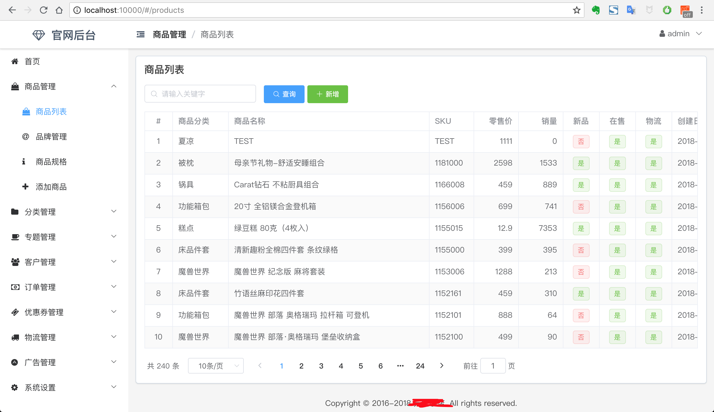
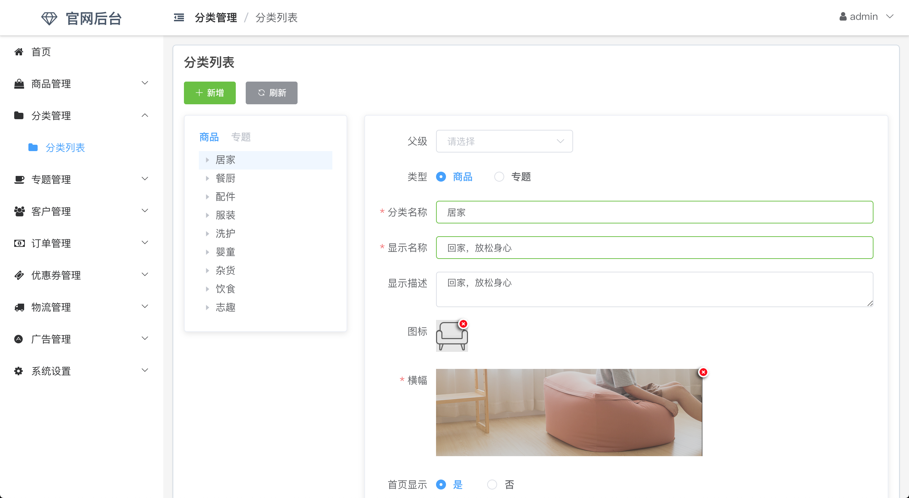
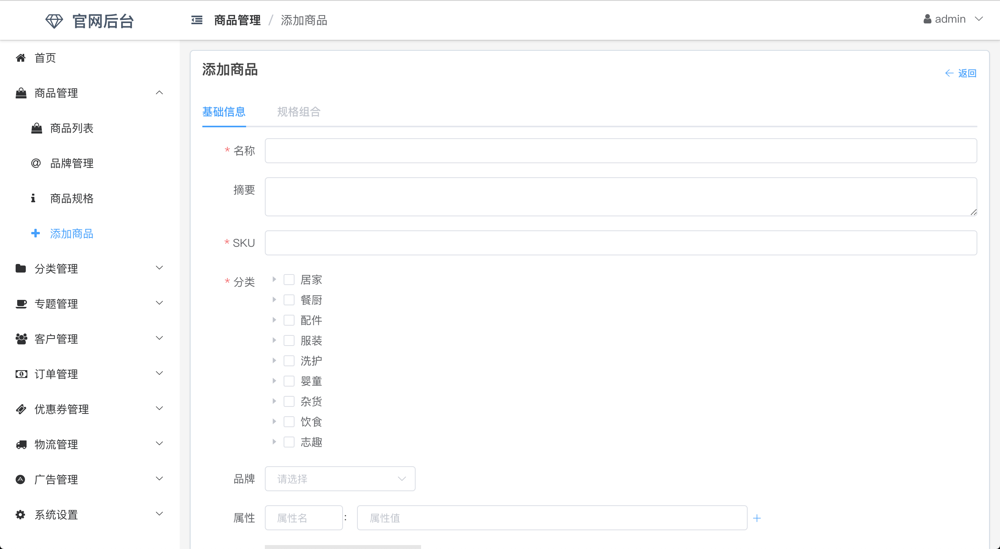
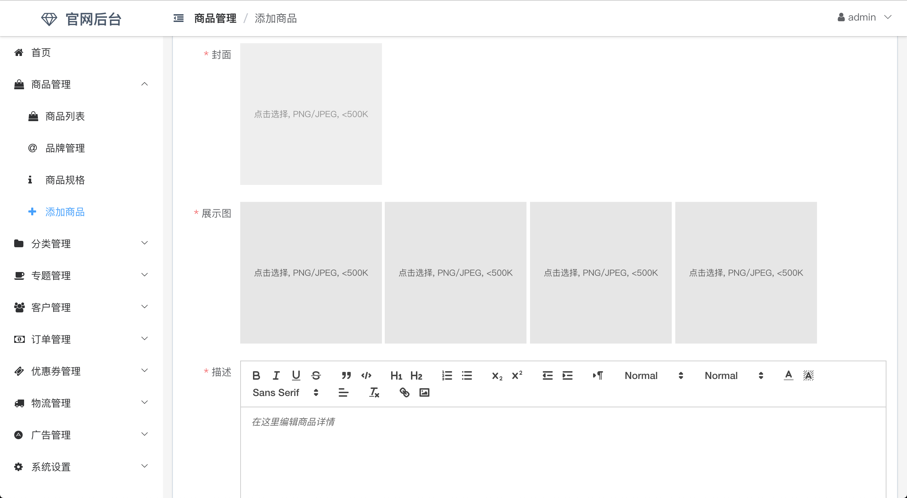

本项目为[nideshop_server_full](https://github.com/saonian/nideshop_server_full)的管理界面，采用VUE+Element UI开发，目前大部分功能都开发完毕。

免费共享，后续不再更新。

## 使用方法

1. 根据[nideshop_server_full](https://github.com/saonian/nideshop_server_full)的说明搭建好后端

2. 修改`config/index.js`下的proxyTable配置为后端接口API地址

3. 修改`src/api/index.js`里的七牛域名配置

4. 运行`npm install`安装依赖

5. 运行`npm run dev`启动项目

6. 使用`admin/jiafeimao`登录项目

## 部分截图

